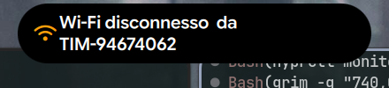

# 🏝️ Tide Island - Apple Dynamic Island for Hyprland

An authentic, fluid **Apple-style Dynamic Island** and modern Control Center implementation for **Hyprland** (Wayland) built with **Quickshell** (Qt 6 / QML) and Python.


---

## ✨ Features & Visual Demonstrations

### 🔋 1. Charging Capsule Animation
Replaces generic transient icons with the genuine Apple battery capsule. Displays *"Charging"*, dynamic green percentage, and an Apple-style battery icon with battery fill and yellow lightning bolt (`⚡`).

| Animated Preview | Still Capture |
| :---: | :---: |
|  |  |

---

### ⚠️ 2. Low Battery Alert
Automatic warning capsule rendered at critical battery levels ($\le 20\%$ and $\le 10\%$). Features Apple-red warning text, red percentage, and a low battery container with an exclamation mark (`!`).

| Animated Preview | Still Capture |
| :---: | :---: |
|  |  |

---

### 🔔 3. Silent & Ring Switch
Physical-switch simulation for volume mute and unmute toggles. Features an animated swinging bell with vibration physics:
- **Silenzioso**: Red slashing line with shaking bell + *"Silenzioso"* label.
- **Suoneria**: Pure white swinging bell chime + *"Suoneria"* label.

| Silenzioso (Muted) | Suoneria (Unmuted) |
| :---: | :---: |
|  |  |

---

### 📞 4. Discord Incoming & Ongoing Call
Authentic call banner for Discord, Vesktop, and Armcord incoming voice calls.

- **Real Caller Avatar**: Automatically extracts caller profile picture from Discord's local cache or CDN.
- **Perfect Circular Mask**: Utilizes GPU shaders (`ClippingRectangle`) for flawless round clipping with antialiasing inside the pulsing call ring.
- **Instant Hangup Dismissal**: Listens to DBus notification dismissal (`CloseNotification`, `NotificationClosed`, and missed call events) to instantly dismiss the island if the caller hangs up.
- **Ongoing Call State**: Transitions to an ongoing call pill with real-time call timer and animated audio waveform.

| Incoming Call (with Avatar) | Ongoing Call (with Waveform) |
| :---: | :---: |
|  |  |

---

### 🎛️ 5. Modern Control Center & Adaptive Sliders
Full macOS / iOS style control center with network, bluetooth, power drawers, and custom sliders:
- **Adaptive Display Icon**: Positioned to the left of the "Display" label, dynamically adapting to brightness level.
- **Adaptive Sound Icon**: Positioned to the left of the "Sound" label, dynamically indicating muted, low, and high volume states.

| Animated Preview | Still Capture |
| :---: | :---: |
|  |  |

---

### 📶 6. Wi-Fi Disconnect Alert
Immediate island alert notification when Wi-Fi connection is dropped or disconnected from an access point.

| Animated Preview | Still Capture |
| :---: | :---: |
|  |  |

---

## 🎥 High-Definition Demonstration Videos

All animation demonstrations are also available in MP4 format under `assets/videos/`:
- [Charging Animation Video](assets/videos/charging_demo.mp4)
- [Low Battery Warning Video](assets/videos/low_battery.mp4)
- [Silent Mode Video](assets/videos/silent_mode.mp4)
- [Ring Mode Video](assets/videos/ring_mode.mp4)
- [Discord Incoming Call Video](assets/videos/discord_call_incoming.mp4)
- [Discord Ongoing Call Video](assets/videos/discord_call_ongoing.mp4)
- [Control Center Video](assets/videos/control_center.mp4)
- [Wi-Fi Disconnect Video](assets/videos/wifi_disconnect.mp4)

---

## 📁 Repository Structure

```
.
├── DynamicIslandWindow.qml      # Main window & Spring animation engine
├── shell.qml                    # Root Scope, IPC handlers & system bindings
├── qml/
│   ├── island/
│   │   ├── BatteryAlertLayer.qml    # Authentic Apple battery charging & low warning
│   │   ├── SilentRingLayer.qml      # Animated swinging bell switch
│   │   ├── DiscordCallLayer.qml     # Discord call pill with avatar & waveform
│   │   ├── IslandSystemState.qml    # Hardware triggers & event debouncing
│   │   ├── OsdLayer.qml             # On-screen volume / brightness displays
│   │   ├── NotificationLayer.qml    # Generic desktop notifications
│   │   └── ...
│   ├── controlcenter/
│   │   ├── ControlCenterLayer.qml   # Control Center panel
│   │   ├── ControlSliderCard.qml    # Sliders with left-aligned adaptive icons
│   │   └── ...
│   └── connectivity/                # Wi-Fi & Bluetooth detail drawers
├── scripts/
│   ├── discord_call_monitor.py      # Real-time DBus notification & hangup daemon
│   └── resolve_discord_avatar.py    # Automatic Discord avatar cache & CDN resolver
├── avatars/                         # Custom contact profile picture overrides
└── assets/
    ├── gifs/                        # High-quality animated demonstrations
    ├── screenshots/                 # High-resolution screenshots
    └── videos/                      # MP4 video recordings
```

---

## 🚀 Installation & Setup

### Prerequisites

Ensure you have the following packages installed on your system:
- **Hyprland** (Wayland compositor)
- **Quickshell** (>= 0.0.8, Qt 6 / QML)
- **Python 3** (with `Pillow` and `dbus-python` if custom monitoring)
- **Nerd Fonts** (e.g. `JetBrainsMono Nerd Font` or `Inter`)
- **grim** & **ffmpeg** (for screenshotting and recording utilities)

### Deployment

1. Clone or copy this repository into your Quickshell configuration folder:
```bash
git clone https://github.com/St0rmosu/tide-island-dynamic.git ~/.config/quickshell/tide-island
```

2. Reload or launch the bar:
```bash
# If using apply-qs-bar script:
~/.scripts/apply-qs-bar.sh tide-island

# Or directly with Quickshell:
quickshell -p ~/.config/quickshell/tide-island -d
```

---

## 👤 Customizing Discord Caller Avatars

The avatar resolver automatically locates avatars from Discord's local cache and LevelDB storage. You can also manually assign custom avatars for any contact:

Place an image named after the Discord username in:
```
~/.config/quickshell/tide-island/avatars/<Username>.png
```
*(Supports `.png`, `.jpg`, `.jpeg`, and `.webp`)*.

---

## ⚡ IPC Terminal Commands (Testing & Scripting)

You can trigger and interact with any feature via `quickshell ipc`:

```bash
# Test Apple charging capsule (specify battery percentage)
quickshell ipc -p ~/.config/quickshell/tide-island call island testCharging 85

# Test low battery warning
quickshell ipc -p ~/.config/quickshell/tide-island call island testLowBattery 15

# Test Silent / Ring switch
quickshell ipc -p ~/.config/quickshell/tide-island call island testSilentRing true   # Silenzioso
quickshell ipc -p ~/.config/quickshell/tide-island call island testSilentRing false  # Suoneria

# Test Discord incoming call (with automatic avatar lookup)
quickshell ipc -p ~/.config/quickshell/tide-island call island testDiscordCall "St0rm"

# Test Discord call with a custom avatar file
quickshell ipc -p ~/.config/quickshell/tide-island call island testDiscordCallWithAvatar "Marco" "file:///path/to/photo.png"

# Close or dismiss call immediately
quickshell ipc -p ~/.config/quickshell/tide-island call island closeCall

# Toggle Control Center
quickshell ipc -p ~/.config/quickshell/tide-island call tide toggleControlCenter

# Test Wi-Fi disconnect alert
quickshell ipc -p ~/.config/quickshell/tide-island call island testWifiDisconnect
```

---

## 📜 License

Distributed under the MIT License. See `LICENSE` for more information.
