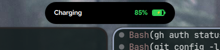
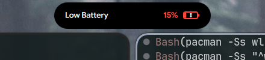
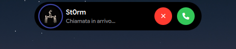
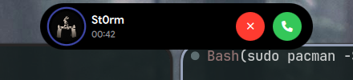
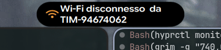
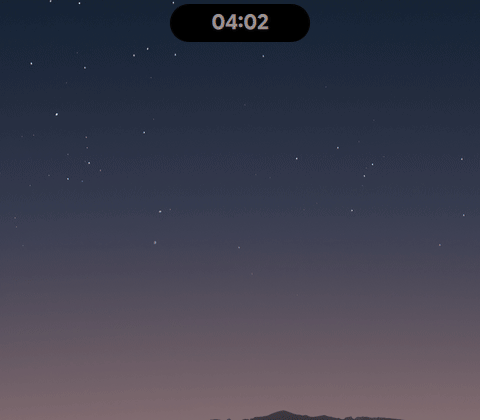
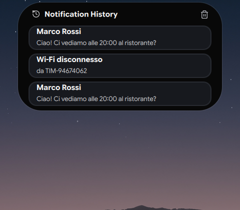
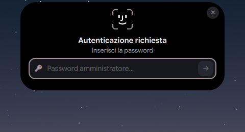
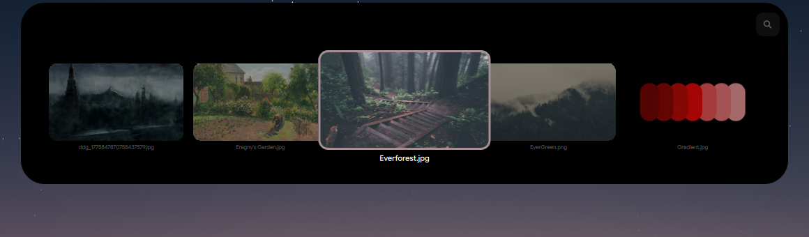

# 🏝️ Dynamic Island Hyprland

An authentic, fluid **Apple-style Dynamic Island** and modern Control Center implementation for **Hyprland** (Wayland) built with **Quickshell** (Qt 6 / QML) and Python.


---

## ✨ Features & Visual Demonstrations

### 🔋 1. Battery & Power Alerts

#### Charging Capsule Animation
Replaces generic transient icons with the authentic Apple battery capsule. Features *"Charging"*, dynamic green battery percentage, and an Apple-style battery icon with battery level fill and yellow lightning bolt (`⚡`).

| Animated Demonstration (Slow Paced) | High-Resolution Screenshot |
| :---: | :---: |
|  |  |

> 🎥 Video: [charging_demo.mp4](assets/videos/charging_demo.mp4)

---

#### Low Battery Warning
Automatic warning capsule rendered at critical battery levels ($\le 20\%$ and $\le 10\%$). Features Apple-red warning text (*"Batteria scarica"*), red percentage, and a low battery container with an exclamation mark (`!`).

| Animated Demonstration (Slow Paced) | High-Resolution Screenshot |
| :---: | :---: |
|  |  |

> 🎥 Video: [low_battery.mp4](assets/videos/low_battery.mp4)

---

### 🔔 2. Audio Profiles & Hardware OSD

#### Silent & Ring Switch
Physical-switch simulation for volume mute and unmute toggles with animated swinging bell physics:
- **Silenzioso**: Red slashing line with vibrating bell and *"Silenzioso"* label.
- **Suoneria**: Pure white swinging bell chime with *"Suoneria"* label.

| Silenzioso (Muted) | Suoneria (Unmuted) |
| :---: | :---: |
|  |  |

> 🎥 Videos: [silent_mode.mp4](assets/videos/silent_mode.mp4) • [ring_mode.mp4](assets/videos/ring_mode.mp4)

---

#### Volume & Brightness On-Screen Display (OSD)
Smooth hardware indicator pills that morph dynamically from the island when adjusting volume or display brightness. Features speaker/sun icons, precise percentage labels, and circular progress gauges.

| Volume OSD | Brightness OSD |
| :---: | :---: |
|  |  |

> 🎥 Videos: [osd_volume.mp4](assets/videos/osd_volume.mp4) • [osd_brightness.mp4](assets/videos/osd_brightness.mp4)

---

### 📞 3. Discord Calling Suite

#### Incoming Call with Caller Avatar
Authentic call banner for Discord, Vesktop, and Armcord voice calls:
- **Real Caller Avatar**: Automatically extracts and resolves profile pictures from Discord's local cache, LevelDB, or CDN.
- **Flawless Circular Mask**: Utilizes GPU shaders (`Quickshell.Widgets.ClippingRectangle`) for perfect round clipping with antialiasing inside the pulsing caller ring.
- **Instant Dismissal**: Listens to DBus notification dismissals (`CloseNotification`, `NotificationClosed`, and missed-call events) to instantly dismiss the banner when the caller hangs up.

| Animated Demonstration | High-Resolution Screenshot |
| :---: | :---: |
|  |  |

> 🎥 Video: [discord_call_incoming.mp4](assets/videos/discord_call_incoming.mp4)

---

#### Ongoing Call Pill
Seamlessly transitions into an ongoing call capsule featuring the caller's avatar, live call timer, animated audio waveform bars, and a quick-hangup button.

| Animated Demonstration | High-Resolution Screenshot |
| :---: | :---: |
|  |  |

> 🎥 Video: [discord_call_ongoing.mp4](assets/videos/discord_call_ongoing.mp4)

---

### 🎵 4. Media Player, Satellite Island & Synced Lyrics

#### Satellite Music Pill & Expanded Player
- **Satellite Floating Island**: Appears automatically alongside the main clock pill when media is playing, showing album artwork in an authentic Apple satellite capsule.
- **Expanded Player**: Fluidly expands into a full player with album artwork, title, artist, live playback progress bar, playback controls, and animated audio equalizer bars.

| Compact Satellite Pill | Expanded Media Player |
| :---: | :---: |
|  |  |

> 🎥 Videos: [music_compact_island.mp4](assets/videos/music_compact_island.mp4) • [expanded_media_player.mp4](assets/videos/expanded_media_player.mp4)

---

#### Live Synced Lyrics & Interactive Countdown Timer
- **Synced Lyrics**: Swipe sideways to reveal real-time synchronized karaoke-style lyrics powered by MPRIS and `lyricsmpris`.
- **Integrated Timer**: Full countdown timer with hour/minute selector, circle progress indicator, and start/reset controls.

| Live Synced Lyrics | Countdown Timer |
| :---: | :---: |
|  |  |

> 🎥 Videos: [synced_lyrics.mp4](assets/videos/synced_lyrics.mp4) • [countdown_timer.mp4](assets/videos/countdown_timer.mp4)

---

### 🎛️ 5. Modern Control Center & System Drawers

#### Full Control Center & Adaptive Sliders
macOS / iOS inspired Control Center with quick toggles, music controls, and custom volume and brightness sliders:
- **Left-Aligned Display Icon**: Adapts visually to brightness level.
- **Left-Aligned Sound Icon**: Dynamically adapts to mute, low, and high audio states.

| Animated Demonstration | High-Resolution Screenshot |
| :---: | :---: |
|  |  |

> 🎥 Video: [control_center.mp4](assets/videos/control_center.mp4)

---

#### Wi-Fi & Bluetooth Connectivity Drawers
Expandable side panels that slide smoothly alongside the Control Center to manage Wi-Fi networks and Bluetooth devices with real-time signal strength and battery levels.

| Wi-Fi Network Drawer | Bluetooth Device Drawer |
| :---: | :---: |
|  |  |

> 🎥 Videos: [control_center_wifi_drawer.mp4](assets/videos/control_center_wifi_drawer.mp4) • [control_center_bluetooth_drawer.mp4](assets/videos/control_center_bluetooth_drawer.mp4)

---

#### Quick Power Menu
Streamlined power drawer offering quick access to Lock, Sleep, Restart, and Shutdown actions.

| Animated Demonstration | High-Resolution Screenshot |
| :---: | :---: |
|  |  |

> 🎥 Video: [control_center_power_menu.mp4](assets/videos/control_center_power_menu.mp4)

---

### 💬 6. Notifications & System Banners

#### Wi-Fi Disconnect Alert & Desktop Notifications
Immediate island notification banners for system alerts and incoming application notifications (e.g. Telegram, Discord, Mail).

| Wi-Fi Disconnect Alert | Desktop Notification Banner |
| :---: | :---: |
|  |  |

> 🎥 Videos: [wifi_disconnect.mp4](assets/videos/wifi_disconnect.mp4) • [desktop_notification.mp4](assets/videos/desktop_notification.mp4)

---

#### Notification History Center
Dropdown notification panel keeping track of all incoming notifications with single-click dismissal and clean history management.

| Animated Demonstration | High-Resolution Screenshot |
| :---: | :---: |
|  |  |

> 🎥 Video: [notification_center.mp4](assets/videos/notification_center.mp4)

---

### 🛡️ 7. System Utilities & Security

#### FaceID-Style Polkit Authentication Prompt
Apple FaceID-style animated security prompt replacing conventional sudo/polkit dialogs with an animated glyph, user verification, and password field.

| Animated Demonstration | High-Resolution Screenshot |
| :---: | :---: |
|  |  |

> 🎥 Video: [polkit_auth.mp4](assets/videos/polkit_auth.mp4)

---

#### Interactive Wallpaper Picker
Full carousel wallpaper browser embedded directly into the island with live thumbnail previews and instant desktop wallpaper application.

| Animated Demonstration | High-Resolution Screenshot |
| :---: | :---: |
|  |  |

> 🎥 Video: [wallpaper_picker.mp4](assets/videos/wallpaper_picker.mp4)

---

#### Spotlight Application Launcher & AirDrop File Shelf
- **Application Launcher**: Spotlight-style search bar and app grid for fast keyboard application launching.
- **File Shelf**: macOS / AirDrop-style drop target on the island for dragging, holding, and dropping files across workspaces and applications.

| Spotlight App Launcher | File Shelf (AirDrop) |
| :---: | :---: |
|  |  |

> 🎥 Videos: [application_launcher.mp4](assets/videos/application_launcher.mp4) • [file_shelf.mp4](assets/videos/file_shelf.mp4)

---

### 🖥️ 8. Compositor & Workspace Integration

#### Workspace Switch Pill & Hyprland Mission Control Overview
- **Workspace Switch**: Responsive capsule displaying active workspace numbers on workspace transition.
- **Mission Control Overview**: Full compositor overview with live wallpaper background and workspace window thumbnails.

| Workspace Switch Capsule | Hyprland Workspace Overview |
| :---: | :---: |
|  |  |

> 🎥 Videos: [workspace_switch.mp4](assets/videos/workspace_switch.mp4) • [workspace_overview.mp4](assets/videos/workspace_overview.mp4)

---

## 📁 Repository Structure

```
.
├── DynamicIslandWindow.qml      # Main window, Spring physics & layer switching
├── shell.qml                    # Root Scope, IPC handlers & system services
├── qml/
│   ├── island/
│   │   ├── BatteryAlertLayer.qml    # Apple battery charging & low battery warning
│   │   ├── SilentRingLayer.qml      # Animated swinging bell switch
│   │   ├── DiscordCallLayer.qml     # Discord call pill with avatar & waveform
│   │   ├── ExpandedPlayerLayer.qml  # Media player with controls & timer
│   │   ├── MusicFloatingIsland.qml  # Satellite compact music pill
│   │   ├── SwipeLyricsLayer.qml     # Dynamic live synced lyrics
│   │   ├── OsdLayer.qml             # On-screen volume and brightness sliders
│   │   ├── PolkitLayer.qml          # Apple FaceID authentication prompt
│   │   ├── WallpaperPickerLayer.qml # Live thumbnail wallpaper carousel
│   │   ├── ApplicationLauncherLayer.qml # Spotlight application search
│   │   ├── FileShelfLayer.qml       # Drag & drop file shelf
│   │   └── ...
│   ├── controlcenter/
│   │   ├── ControlCenterLayer.qml   # Control Center panel
│   │   ├── ControlSliderCard.qml    # Sliders with left-aligned adaptive icons
│   │   └── NotificationCenterLayer.qml # Notification history panel
│   └── connectivity/                # Wi-Fi & Bluetooth detail drawers
├── scripts/
│   ├── discord_call_monitor.py      # Real-time DBus notification & hangup daemon
│   └── resolve_discord_avatar.py    # Automatic Discord avatar cache & CDN resolver
├── avatars/                         # Custom contact profile picture overrides
└── assets/
    ├── gifs/                        # Slow-paced (10 fps) fluid animated demonstrations
    ├── screenshots/                 # Crisp high-resolution screenshots
    └── videos/                      # H.264 MP4 video recordings
```

---

## 🚀 Installation & Setup

### Prerequisites

Ensure you have the following packages installed on your system:
- **Hyprland** (Wayland compositor)
- **Quickshell** (>= 0.0.8, Qt 6 / QML)
- **Python 3** (with `Pillow` and `dbus-python`)
- **Nerd Fonts** (e.g. `JetBrainsMono Nerd Font` or `Inter`)
- **grim** & **ffmpeg** (for screenshotting and screen recording utilities)

### Deployment

1. Clone this repository into your Quickshell configuration directory:
```bash
git clone https://github.com/St0rmosu/dynamic-island-hyprland.git ~/.config/quickshell/tide-island
```

2. Launch or reload the bar:
```bash
# If using quickshell directly:
quickshell -p ~/.config/quickshell/tide-island -d

# Or using your apply script:
~/.scripts/apply-qs-bar.sh tide-island
```

---

## ⚡ IPC Terminal Commands (Testing & Scripting)

You can trigger and interact with any feature via `quickshell ipc`:

```bash
# Battery & Power
quickshell ipc -p ~/.config/quickshell/tide-island call island testCharging 85
quickshell ipc -p ~/.config/quickshell/tide-island call island testLowBattery 15

# Silent / Ring Switch
quickshell ipc -p ~/.config/quickshell/tide-island call island testSilentRing true   # Silenzioso
quickshell ipc -p ~/.config/quickshell/tide-island call island testSilentRing false  # Suoneria

# Hardware OSD
quickshell ipc -p ~/.config/quickshell/tide-island call island testVolume 65
quickshell ipc -p ~/.config/quickshell/tide-island call island testBrightness 80

# Discord Calls
quickshell ipc -p ~/.config/quickshell/tide-island call island testDiscordCall "St0rm"
quickshell ipc -p ~/.config/quickshell/tide-island call island testDiscordCallOngoing "St0rm"
quickshell ipc -p ~/.config/quickshell/tide-island call island acceptCall
quickshell ipc -p ~/.config/quickshell/tide-island call island declineCall
quickshell ipc -p ~/.config/quickshell/tide-island call island closeCall

# Media Player & Utilities
quickshell ipc -p ~/.config/quickshell/tide-island call tide togglePlayer
quickshell ipc -p ~/.config/quickshell/tide-island call tide showTimer
quickshell ipc -p ~/.config/quickshell/tide-island call tide showLyrics
quickshell ipc -p ~/.config/quickshell/tide-island call tide showCustom

# Control Center & Drawers
quickshell ipc -p ~/.config/quickshell/tide-island call tide toggleControlCenter
quickshell ipc -p ~/.config/quickshell/tide-island call island testDetailPanel wifi true
quickshell ipc -p ~/.config/quickshell/tide-island call island testDetailPanel bluetooth true
quickshell ipc -p ~/.config/quickshell/tide-island call tide togglePowerMenu

# System Panels & Security
quickshell ipc -p ~/.config/quickshell/tide-island call tide toggleNotificationCenter
quickshell ipc -p ~/.config/quickshell/tide-island call island testPolkit
quickshell ipc -p ~/.config/quickshell/tide-island call island closePolkit
quickshell ipc -p ~/.config/quickshell/tide-island call tide toggleWallpaperPicker
quickshell ipc -p ~/.config/quickshell/tide-island call tide toggleApplicationLauncher
quickshell ipc -p ~/.config/quickshell/tide-island call tide toggleFileShelf

# Overview & Workspaces
quickshell ipc -p ~/.config/quickshell/tide-island call island testWorkspace 3
quickshell ipc -p ~/.config/quickshell/tide-island call overview open
quickshell ipc -p ~/.config/quickshell/tide-island call overview close
```

---

## 📜 License

Distributed under the MIT License. See `LICENSE` for more information.
