<div align="center">

# 🏝️ Dynamic Island Hyprland

**An authentic, fluid Apple-style Dynamic Island & modern Control Center for Hyprland (Wayland)**

[]()
[-7F60F6.svg?style=for-the-badge&logo=qt&logoColor=white)](https://github.com/outfoxxed/quickshell)
[]()
[]()
[](LICENSE)

<br/>

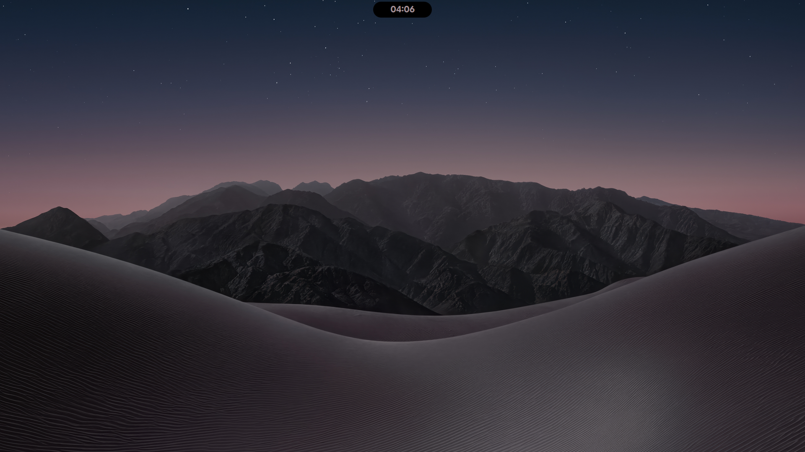

*Silky-smooth, spring-driven 60 FPS animations on a clean, distraction-free desktop.*

</div>

---

## 📖 Overview

**Dynamic Island Hyprland** is a complete, native desktop shell for Wayland built with **Quickshell (Qt 6 / QML)** and backed by a high-performance **native C++20 plugin (`IslandBackend`)** and MPRIS synchronized lyrics daemon (`lyricsmpris`).

Anchored cleanly at the top center of your screen, the island provides an authentic iOS-style interactive pill that fluidly morphs across hardware alerts, media sessions, system status, and calls at a silky-smooth **60 FPS**. When triggered, it gracefully expands into a feature-packed macOS/iOS-inspired **Control Center**, connectivity drawers, or a standalone **Settings App** with an interactive visual **Studio Layout Canvas**.

### ✨ Highlights
- **60 FPS Fluid Physics**: Powered by Qt Quick spring curves (`Easing.OutQuint`, `Easing.OutCubic`) for natural, organic motion without dropped frames.
- **Standalone Native C++ Backend**: Ships with its own compiled Qt6 QML module (`IslandBackend`) for ultra-low latency window tracking, D-Bus communication, and hardware control.
- **Automatic Satellite Balancing**: The island dynamically recalculates its center of mass and glides smoothly to stay perfectly centered when docked satellite pills (Discord calls, Bluetooth headphones) appear.
- **Mechanical Flip Clock**: Time digits transition with a vertical rolling odometer animation.
- **Native Screen Share Picker & Privacy Rule**: Embedded Apple-style picker with restore-token support, coupled with `no_screen_share` layerrule privacy masking to keep streams clean.
- **Streamlined Installer**: One-click `./install.sh` building user-level (`~/.local/`) or system-wide binaries, modular Hyprland autostart detection, and automated GTK3, GTK4 (Libadwaita), Qt5, and Qt6 color synchronization.

---

## 📑 Table of Contents

- [Features & Visual Showcase](#-features--visual-showcase)
  - [1. Dynamic Island Core & Fluid Morphing](#1-dynamic-island-core--fluid-morphing)
  - [2. Hardware Alerts & Adaptive OSD](#2-hardware-alerts--adaptive-osd)
  - [3. Modern Control Center & System Drawers](#3-modern-control-center--system-drawers)
  - [4. Settings App & Studio Layout Canvas](#4-settings-app--studio-layout-canvas)
  - [5. Discord Calling Suite & Communications](#5-discord-calling-suite--communications)
  - [6. Media Player & Synced Lyrics](#6-media-player--synced-lyrics)
  - [7. Privacy, Streaming & Screen Sharing](#7-privacy-streaming--screen-sharing)
  - [8. System Utilities & Productivity](#8-system-utilities--productivity)
- [🏗️ Architecture & Backend](#-architecture--backend)
- [📦 Essential Dependencies](#-essential-dependencies)
- [🚀 Quick Start & Installation](#-quick-start--installation)
- [⌨️ Keybindings & Hyprland Integration](#-keybindings--hyprland-integration)
- [📜 License](#-license)

---

## ✨ Features & Visual Showcase

All demonstrations and screenshots are captured on a clean, empty workspace highlighting the 60 FPS physics-based animations.

### 1. Dynamic Island Core & Fluid Morphing

#### Resting Capsule, Flip Clock & Satellite Balancing
- **Flip Clock Rolling Digits**: As the time advances, changed digits animate upward in a synchronized rolling odometer effect.
- **Auto-Balancing Satellites**: When satellite pills dock on one side (e.g. active call or connected headphones), the island smoothly glides along the X-axis to keep the visual center of mass aligned at `50%`.

<table>
  <tr>
    <td align="center" width="50%">
      
      <br/>
      <sub><b>Flip Clock & Info Transition</b> — 60 FPS fluid horizontal swipe and upward rolling digits</sub>
    </td>
    <td align="center" width="50%">
      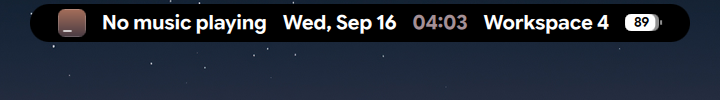
      <br/>
      <sub><b>Resting Island Capsule</b> — Minimalist matte glass pill centered at the top</sub>
    </td>
  </tr>
</table>

---

### 2. Hardware Alerts & Adaptive OSD

#### Apple Battery Alerts & Physical Switch Simulation
- **Charging Capsule**: Replaces generic icons with an authentic Apple battery pill featuring dynamic charge percentage, battery fill level, and charging bolt indicator.
- **Low Battery Warning**: Automatic warning pill rendered at critical battery levels ($\le 20\%$ and $\le 10\%$).
- **Silent & Ring Physical Switch**: Realistic physical switch simulation for mute toggles with animated swinging bell physics.
- **Volume & Brightness OSD**: Adaptive indicator pills that morph dynamically from the island when adjusting hardware sliders.

<table>
  <tr>
    <td align="center" width="50%">
      
      <br/>
      <sub><b>Charging Alert</b> — Dynamic green battery level with charging bolt</sub>
    </td>
    <td align="center" width="50%">
      
      <br/>
      <sub><b>Low Battery Warning</b> — Warning capsule with red accents and prompt</sub>
    </td>
  </tr>
  <tr>
    <td align="center" width="50%">
      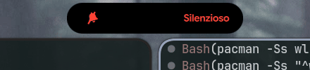
      <br/>
      <sub><b>Silent Mode</b> — Animated swinging bell with vibration and slash line</sub>
    </td>
    <td align="center" width="50%">
      
      <br/>
      <sub><b>Ring Mode</b> — Swinging white chime switch with tactile feedback</sub>
    </td>
  </tr>
  <tr>
    <td align="center" width="50%">
      
      <br/>
      <sub><b>Volume OSD</b> — Morphing hardware slider with circular progress</sub>
    </td>
    <td align="center" width="50%">
      
      <br/>
      <sub><b>Brightness OSD</b> — Real-time display backlight gauge</sub>
    </td>
  </tr>
</table>

---

### 3. Modern Control Center & System Drawers

#### Full Control Center, Connectivity Drawers & Power Menu
- **Control Center**: Comprehensive panel with quick toggles, adaptive volume and brightness sliders, media playback card, and modular widgets.
- **Synchronized Tray Pill**: Independent satellite tray pill positioned directly beneath the Control Center, moving frame-by-frame with zero lag.
- **Wi-Fi & Bluetooth Drawers**: Side-sliding connectivity panels displaying real-time signal strengths, device battery states, and network scanning.
- **Dedicated Power Menu**: Enlarged 420x96px tactile glass capsule featuring Lock, Logout, Sleep, Restart, and Shutdown actions.

<table>
  <tr>
    <td align="center" width="50%">
      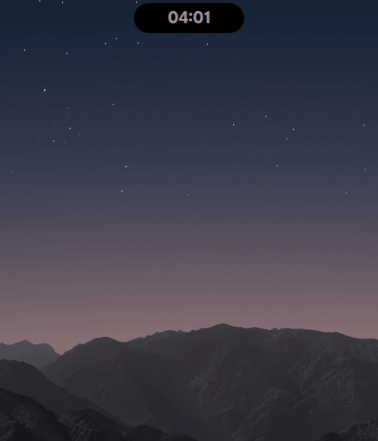
      <br/>
      <sub><b>Control Center</b> — Fluid expansion with adaptive cards and sliders</sub>
    </td>
    <td align="center" width="50%">
      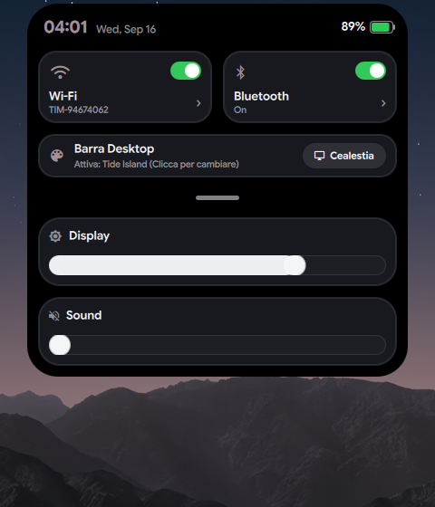
      <br/>
      <sub><b>Control Center Overview</b> — Full layout with synchronized status tray</sub>
    </td>
  </tr>
  <tr>
    <td align="center" width="50%">
      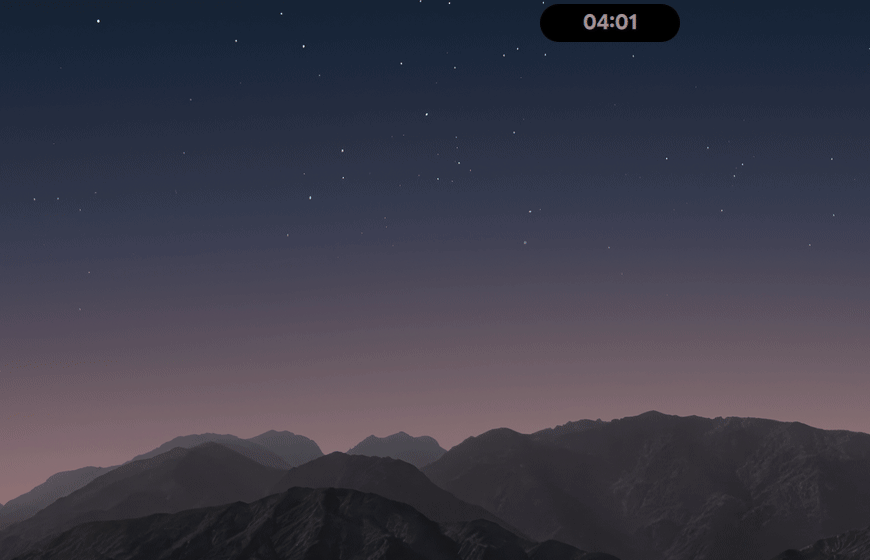
      <br/>
      <sub><b>Wi-Fi Drawer</b> — Live SSID scan, signal strength and connection controls</sub>
    </td>
    <td align="center" width="50%">
      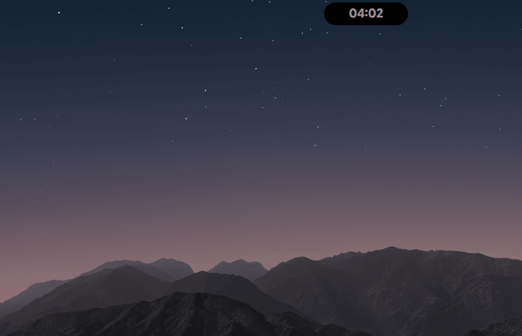
      <br/>
      <sub><b>Bluetooth Drawer</b> — Device pairing, battery levels, and disconnect actions</sub>
    </td>
  </tr>
  <tr>
    <td align="center" width="50%">
      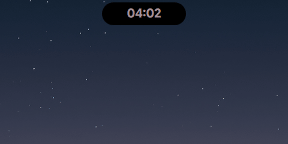
      <br/>
      <sub><b>Power Menu</b> — Tactile glass buttons with instant keyboard dismissal</sub>
    </td>
    <td align="center" width="50%">
      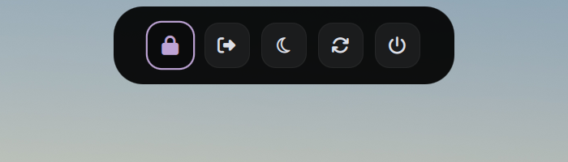
      <br/>
      <sub><b>Power Menu View</b> — 5-action session capsule</sub>
    </td>
  </tr>
</table>

---

### 4. Settings App & Studio Layout Canvas

- **Standalone Settings App**: 980x680 floating GUI window with 5 categories (`Bar & Island`, `Control Center`, `Appearance`, `Motion & Animation`, `Modules`).
- **Studio Layout Canvas**: Visual drag-and-drop grid customizer embedded in the Control Center settings tab, supporting 4-corner card resizing, single-click height adjustments, and live JSON persistence to `~/.config/dynamic-island/userconfig.json`.

<table>
  <tr>
    <td align="center" width="50%">
      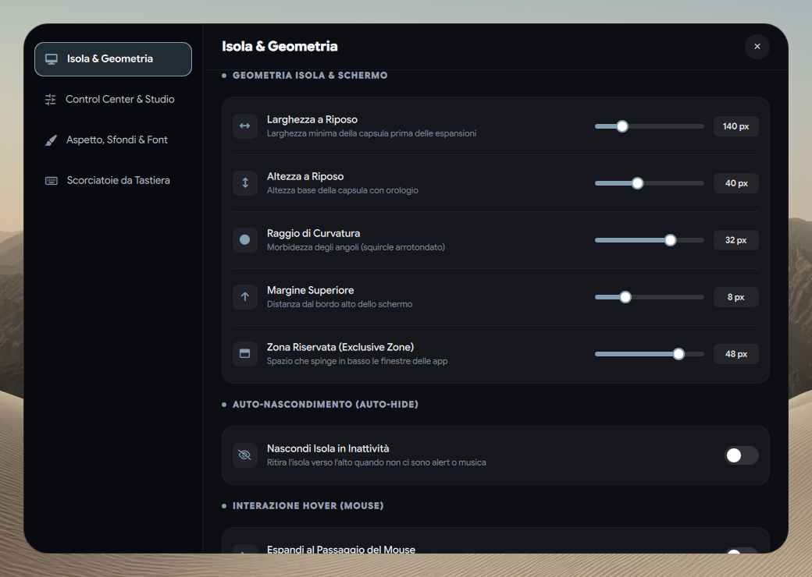
      <br/>
      <sub><b>Settings App</b> — 980x680 floating GUI window with 5 categories & live JSON persistence</sub>
    </td>
    <td align="center" width="50%">
      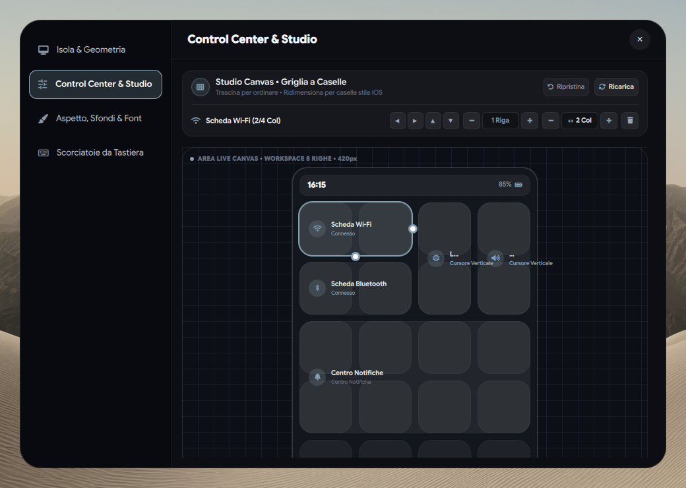
      <br/>
      <sub><b>Studio Layout Canvas</b> — Visual drag-and-drop grid customizer for Control Center cards</sub>
    </td>
  </tr>
</table>

---

### 5. Discord Calling Suite & Communications

- **Incoming Call Banner**: Automatically resolves caller profile pictures from Discord's local cache or CDN, rendered with a flawless GPU shader circular mask and real-time DBus dismissal.
- **Ongoing Call Pill**: Compact satellite pill showing caller avatar, live call timer, animated audio waveform bars, and hangup button.

<table>
  <tr>
    <td align="center" width="50%">
      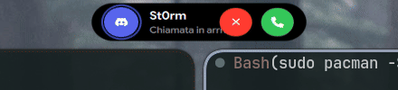
      <br/>
      <sub><b>Incoming Call Banner</b> — Profile avatar, pulsing ring, and action buttons</sub>
    </td>
    <td align="center" width="50%">
      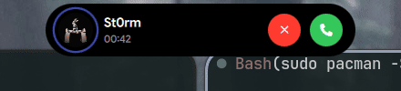
      <br/>
      <sub><b>Ongoing Call Pill</b> — Dynamic call timer with audio waveform bars</sub>
    </td>
  </tr>
</table>

---

### 6. Media Player & Synced Lyrics

- **Satellite Music Pill**: Appears automatically alongside the clock when media is playing, showing album artwork in a compact satellite capsule.
- **Expanded Player**: Fluidly expands into a full player with album artwork, title, artist, live playback progress bar, and animated audio equalizer bars.
- **Live Synced Lyrics**: Powered by MPRIS and the native `lyricsmpris` C++ daemon, displaying the current song lyric line synchronized in real time inside the compact island capsule when swiping left.
- **Interactive Timer**: Integrated countdown timer with circular progress gauge and quick presets.

<table>
  <tr>
    <td align="center" width="50%">
      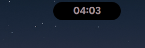
      <br/>
      <sub><b>Satellite Music Pill</b> — Compact album art pill docked beside the island</sub>
    </td>
    <td align="center" width="50%">
      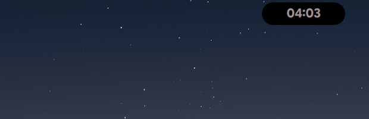
      <br/>
      <sub><b>Expanded Media Player</b> — Full controls, timeline scrubber, and CAVA visualizer</sub>
    </td>
  </tr>
  <tr>
    <td align="center" width="50%">
      
      <br/>
      <sub><b>Live Synced Lyrics</b> — Real-time line progression via MPRIS & lyricsmpris</sub>
    </td>
    <td align="center" width="50%">
      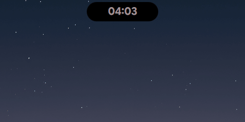
      <br/>
      <sub><b>Interactive Countdown Timer</b> — Quick time picker with circular progress ring</sub>
    </td>
  </tr>
</table>

---

### 7. Privacy, Streaming & Screen Sharing

- **Native Screen Share Picker**: Apple-style modal dialog with large preview cards for entire screen, specific windows, or region selection with slurp. Includes a persistent **Restore Token** toggle to prevent repeated browser prompts.
- **Zero Stream Leakage (`no_screen_share`)**: Automatic layer-shell exclusion rules ensure the Dynamic Island, incoming notifications, and control centers are completely omitted from screencopy and video buffers (OBS, Discord, Zoom, Meet), while remaining fully visible on your monitor.
- **Recording Indicator**: Prominent live transmission pill and glowing broadcast indicator active whenever screen sharing or recording is detected.

<table>
  <tr>
    <td align="center" width="100%">
      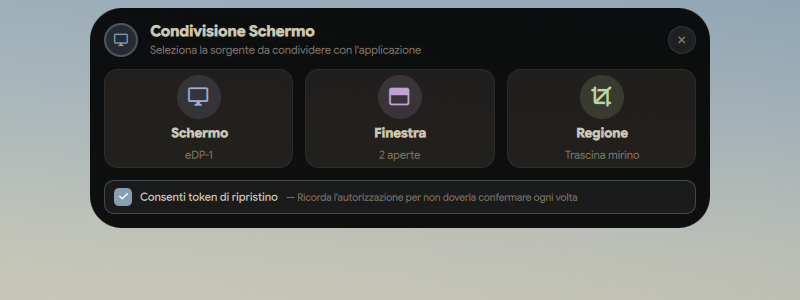
      <br/>
      <sub><b>Native Screen Share Picker</b> — Apple-style source selection (Screen, Window, Region) with Iris palette & persistent Restore Token checkbox</sub>
    </td>
  </tr>
</table>

---

### 8. System Utilities & Productivity

- **Apple FaceID Polkit Prompt**: Replaces standard password dialogs with an animated FaceID glyph, user card, and password field.
- **3D Wallpaper Carousel**: Coverflow carousel browsing wallpapers with live thumbnail generation and automated palette extraction.
- **Spotlight App Launcher**: Fast keyboard application search and launch grid.
- **AirDrop File Shelf**: Drag-and-drop staging area on the island for holding files across workspaces.

<table>
  <tr>
    <td align="center" width="50%">
      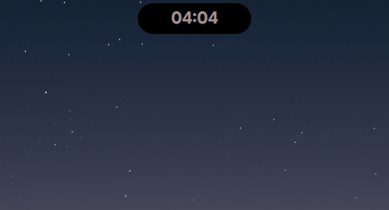
      <br/>
      <sub><b>FaceID Polkit Prompt</b> — Apple-style authentication prompt with animated glyph</sub>
    </td>
    <td align="center" width="50%">
      
      <br/>
      <sub><b>Wallpaper Picker</b> — 3D coverflow carousel with automated GTK/Qt syncing</sub>
    </td>
  </tr>
  <tr>
    <td align="center" width="50%">
      
      <br/>
      <sub><b>Spotlight App Launcher</b> — Instant fuzzy application search and launch</sub>
    </td>
    <td align="center" width="50%">
      
      <br/>
      <sub><b>AirDrop File Shelf</b> — Drag, hold, and drop files across desktops</sub>
    </td>
  </tr>
  <tr>
    <td align="center" width="50%">
      
      <br/>
      <sub><b>Workspace Indicator</b> — Active workspace pill on desktop transition</sub>
    </td>
    <td align="center" width="50%">
      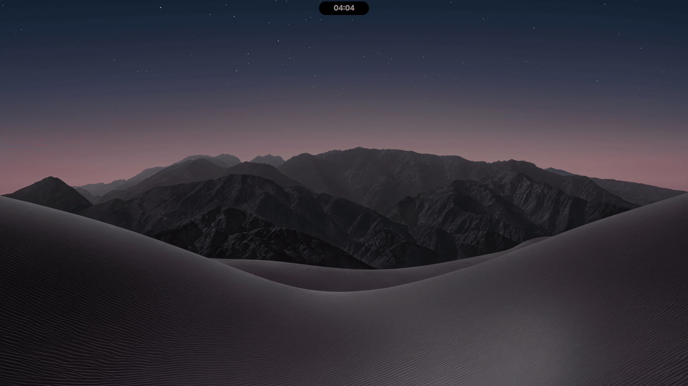
      <br/>
      <sub><b>Mission Control Overview</b> — Full compositor window overview</sub>
    </td>
  </tr>
</table>

---

## 🏗️ Architecture & Backend

```
dynamic-island-hyprland/
├── backend/                  # IslandBackend: Native C++20 Qt6 QML Plugin
│   ├── CompositorBackend     # Wayland layer-shell & active window tracking
│   ├── UserConfigBackend     # Dynamic JSON schema loader & persistence
│   ├── WifiController        # NetworkManager D-Bus client
│   └── BluetoothPairingAgent # BlueZ D-Bus integration
├── lyricsmpris/              # lyricsmpris: MPRIS synchronized lyrics daemon
├── qml/                      # QML Component Layers
│   ├── island/               # Island capsule, OSDs, alerts, and satellite pills
│   ├── controlcenter/        # Control Center, Settings App, and Studio Canvas
│   └── connectivity/         # Wi-Fi & Bluetooth sliding detail drawers
├── scripts/                  # Shell launchers, screen share wrapper & helpers
├── CMakeLists.txt            # Root build configuration for backend & lyricsmpris
└── install.sh                # Automated installer & dependency manager
```

- **`IslandBackend` (Qt6 Plugin)**: Built directly in C++ to provide seamless, low-overhead access to native Linux APIs, eliminating the need for slow external polling scripts.
- **`lyricsmpris`**: Synchronous MPRIS lyrics parser providing smooth sub-second line synchronization.

---

## 📦 Essential Dependencies

The installer checks and installs strictly what is needed for the shell to function:

### Core Packages (Arch Linux / pacman)
```bash
cmake ninja qt6-base qt6-declarative jq socat libnotify brightnessctl playerctl wireplumber slurp grim bluez bluez-utils
```

### AUR Packages
- **`quickshell`** (or `quickshell-git`)
- **`awww`** (default animated wallpaper backend)

---

## 🚀 Quick Start & Installation

Clone the repository and run the automated installer:

```bash
# 1. Clone into your Quickshell configuration path
git clone https://github.com/St0rmosu/dynamic-island-hyprland.git ~/.config/quickshell/dynamic-island

# 2. Enter directory and run the installer
cd ~/.config/quickshell/dynamic-island
chmod +x install.sh
./install.sh
```

### What `install.sh` Does:
1. **Verifies Dependencies**: Checks for missing packages and offers automatic installation via `yay`, `paru`, or `pacman`.
2. **Compiles C++ Backend**: Builds `IslandBackend` and `lyricsmpris` using CMake and installs them cleanly to `~/.local/` (no root/sudo required).
3. **Deploys Runtime Config**: Sets up `~/.local/bin/dynamic-island` and configures `~/.config/dynamic-island/userconfig.json`.
4. **Configures Hyprland Autostart**: Detects whether your Hyprland setup is modular (Lua or `.conf`) or monolithic, safely injecting `dynamic-island -d` without duplication.
5. **Configures Screencopy Privacy**: Ensures `no_screen_share` layer rules are configured so the island stays private during streaming.
6. **Configures Wallpaper Engine & Theming**: Sets up wallpaper transition scripts with automated color palette synchronization for **GTK-3.0, GTK-4.0 (Libadwaita), Qt5, and Qt6** apps.

To launch or restart the island immediately:
```bash
dynamic-island -d
```

---

## ⌨️ Keybindings & Hyprland Integration

Add the following keybindings to your Hyprland configuration (e.g. `~/.config/hypr/hyprland.conf` or `binds.lua`):

| Action | Shortcut (Recommended) | Command / Dispatcher |
| :--- | :--- | :--- |
| **Control Center** | `SUPER + SHIFT + C` | `quickshell ipc --any-display -p ~/.config/quickshell/dynamic-island call island toggleControlCenter` |
| **Power Menu** | `SUPER + ESCAPE` | `quickshell ipc --any-display -p ~/.config/quickshell/dynamic-island call island togglePowerMenu` |
| **Settings App** | `SUPER + I` | `quickshell ipc --any-display -p ~/.config/quickshell/dynamic-island call island toggleSettingsApp` |
| **Wallpaper Picker** | `SUPER + ALT + SPACE` | `quickshell ipc --any-display -p ~/.config/quickshell/dynamic-island call island toggleWallpaperPicker` |
| **Clipboard History** | `SUPER + C` | `quickshell ipc --any-display -p ~/.config/quickshell/dynamic-island call island toggleClipboard` |
| **Toggle Island Bar** | `SUPER + W` | `dynamic-island -d` |

---

## 📜 License

Distributed under the **MIT License**. See [`LICENSE`](LICENSE) for complete terms and details.
